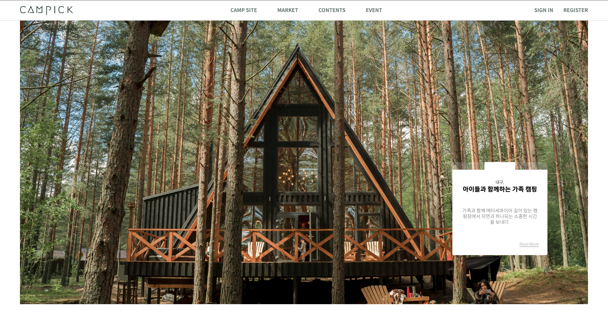

# ⛺️ CAMPICK
> "캠핑(camping)" + "선택하다(pick)" = "캠픽(campick)", 사용자들이 자신이 선택한 캠핑장과 물품 정보를 나누며 즐길 수 있는 캠핑 커뮤니티 웹사이트
### 💡 campick 소개
 현대 사회에서 캠핑은 자연을 즐기고 스트레스를 해소하는 활동으로 인기를 끌고 있습니다. <br> 그러나 캠핑 관련 정보를 공유하고 소통할 수 있는 커뮤니티가 부족하여, 캠핑 애호가들 간의 정보 교류와 문화 확산이 제한적입니다. <br>
 이러한 문제점을 해결하기 위해 좀 더 편리하게  ***캠핑장 검색, 캠핑 물품 중고거래, 캠핑에 관한 정보 공유***를 할 수 있는 캠핑 애호가들을 위한 웹사이트 "캠픽(Campick)"을 제작하게 되었습니다.



[Deploy Link] <https://campickk.netlify.app>

### 👫 팀원

|김수진|신유진|이윤재|최지윤|
|---|---|---|---|
|Front-end|Front-end|Front-end|Front-end|
|발 표자료|Back-end|Back-end|Design|
### 🗓️ 개발 기간
- 2024년 5월 29일 ~ 2024년 7월 10일

### 🛠️ 개발 환경
- Front-end <br>
  
  
 
 
 


- Back-end <br>


- Database <br>
 

- Design <br>


- Communication <br>


- Environment <br>


- Config <br>


- Deploy <br>


### 👩🏻‍💻 페이지별 주요 기능 및 개인 역할
- 김수진 : 로그인 및 회원가입
  - 아이디와 비밀번호 유효성 검사
  - 아이디 중복 검사
- 신유진 : 마켓 및 블로그 게시판
  - 마켓 : 판매 글 작성 및 삭제, 이미지를 제외한 나머지 정보 수정 가능, 작서자(판매자)는 판매 상태 수정 가능, 제목에 포함된 키워드로 검색, socket통신으로 판매자와 구매자 채팅
  - 블로그 : react-quill을 사용하여 글 작성, 삭제, 수정
  - 모든 이미지는 cloudinary에서 관리
  - 반응형
- 이윤재 : 캠핑장 검색, 마이페이지
  - 캠핑장 검색 : 공공 API를 활용하여 캠핑장 목록 구현, 검색, 캠핑장 리뷰 및 별점, 무한스크롤
  - 마이페이지 :  주어진 미션에 따라 빙고와 쿠폰 발급, 사용자가 작성한 게시글 보기, 정보 수정, 회원 탈퇴
  - 반응형 
- 최지윤 : 헤더 및 푸터, 메인페이지, 비디오, 이벤트
  - 메인페이지 : 블로그 최신 글 3개를 불러와서 슬라이드로 구현, 캠핑 관련 유튜브 영상, 이벤트 페이지 이미지 슬라이드로 구현
  - 비디오 및 이벤트 페이지 : 캠핑 관련 영상과 각 지역별 행사 포스터 이미지로 제공


### 💻 구조
```
📦campick-server
┣ 📂constants
┣ 📂controller
┣ 📂models
┣ 📂routes
┣ 📂services
┣ 📂utils
┣ 📜server.js
┗ 📜package.json
```
```
📦campick-client
┣ 📂public
┃ ┣ 📂images
┃ ┃ ┣ 📂ContentsImage
┃ ┃ ┣ 📂ContentsVideo
┃ ┃ ┗ 📂EventImage
┃ ┣ 📜index.html
┃ ┗ 📜favicon.ico
┣ 📂src
┃ ┣ 📂components
┃ ┣ 📂pages
┃ ┣ 📂store
┃ ┣ 📂utils
┃ ┗ 📜App.js
┣ 📜README.md
┣ 📜package.json
┗ 📜.gitignore
```

### 💣 이슈 및 해결
**1. db 에서 findOneAndUpdate 로 Data 업데이트 하는데 갱신버튼 한번 눌렀는데 적용 안 되고 한번 더 눌러야 적용되는 오류**  


> 👉🏻 findOneAndUpdate 내부에 `{ new: true }` 를 추가하여 해결

**2. register 페이지 서버단에서 DB에 값이 create 되지 않는 문제 발견**  


> 👉🏻 초기 스키마 userId, nickname, pw 등이 `required : true` 옵션을
갖고 있어 필수 값 설정이 셋팅되어 있는데 스키마가 변경되며 새로운 값과 초기 값의 차이가 존재했고 mongoDB에 indexes 설정된 값이 지켜지지 않아 발생한 문제.
`mongodb -> campick -> browse collections -> 문제의 collection (ex posts, camps etc) 클릭 -> Indexes`
의 경로로 들어가 옛날 키 이름을 삭제하여 해결

**3. react 환경변수 설정 문제 - 민감 정보를 환경변수로 처리하기 위해 .env 폴더로 관리하던 중 환경변수에 문제가 발생.**  


> 👉🏻 react는 환경변수를 설정할 때 `REACT_APP_'환경변수'`  의 형태로 작성해야 함. react 에 맞는 환경변수 폼 설정으로 문제 해결

**4.  env 설정이 반영 안 되는 문제**  


> 👉🏻 서버, client를 저장해서 다시 새로고침 하는 것과는 다르게 `.env` 폴더 내부 변경점이 생겼을 경우 아예 켜둔 서버 및 client를 종료 후 재 실행해야 .env가 반영됨

**5. mobile 환경에서 의도하지 않은 x축 스크롤 문제**  


> 👉🏻 react 도 마찬가지로 index.html body 내부
`<div class="root"></div>` 를 div 태그로 감싸고 class 를 wrap 으로 주고 css 설정을 `overflow: hidden` 을 적용하여 해결

**6. `overflow: hiddeen` 적용 후 header 영역에 position : sticky  가 작동하지 않는 오류가 발생**  


> 👉🏻 `position : sticky`  옵션은 부모 요소가 `overflow: hidden`  을 설정했거나, `top, right, bottom, left` 중 하나라도 설정을 안 한 경우 오류를 발생한다.
wrap 부분 overflow 옵션을 `overflow-x : clip` 혹은
`overflow-x : hidden;
overflow-y : scroll;
`
을 주어 해결
